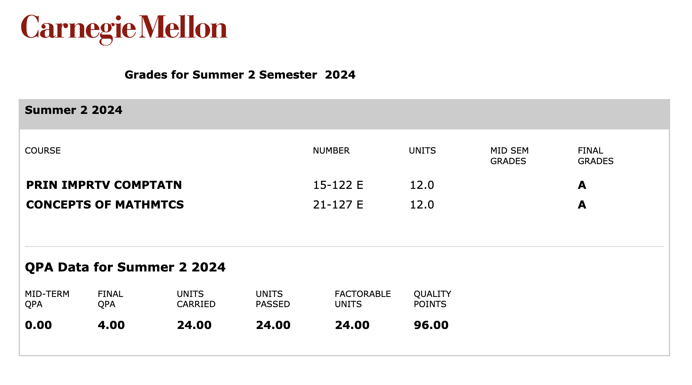

## Course Thoughts

### 15-122 Principles of Imperative Computation

A brief introduction to those who didn't take this course: C0 and C1 lang, languages developed at CMU for education purposes. Contracts are the top language feature, which was used in this course to prove the safety and correctness of the code. Safety proof and correctness proof are the most painful part of this course, and also the part you will probably lose points on during tests. The difference between C0 and C1 is that void pointers can be used in C1 so we can write generic functions. Actually, this is my first time using generic pointers, instead of generic types.

So far these have covered half of the content. The next part is transitioning to *the C Programming Language* and data structures. In fact, starting from C1, we have been implementing generic hash map dictionaries and doing amortize analysis on unbounded arrays (vectors in cpp). Binary search and AVL trees, undirected graphs, and binary heaps are the easiest parts in this course imo. Perhaps it is becuz of reading the [*Competitive Programmer’s Handbook*](https://github.com/pllk/cphb).

To sum up, we learnt:

- C0 and C1
- sorting and searching algos
- unbounded array
- hash dict
- void \* (generic pointers)
- BST & AVL tree
- type casting in C
- graph and binary heaps

This course is quite hardcore tbh. We had 12 written for 10 pages each and 10 programming homework. A typical coding assignment takes 2 hours to finish and 4 more hours to debug. Everyone should have the same fear to debug your code, especially when you firmly believe that you coded it right... That being said, if you are not familiar with ssh, unix system, vscode, vim, coding styles, gdb (optional, for debugging in the C part), and some other well-known programming concepts, you may have a hard time catching up with the assignments and labs, and it might be much harder to get a good score in this course.

But it was a great chance for me to explore C, such a low-level system programming language. I realized how much syntactic sugar other high-level programming languages have provided to us, and in comparison to Cpp, C is even lower leveled. Manually memory management, null pointer dereferences, void pointer castings, integer type convertings, self-implemented data structures... All the 'guns' that you may fire and shoot on your feet.

### 12-127 Concepts of Mathematics

This course taught some basic concepts in pure mathematics, which are the fundamental components that build the entire world of math. You will learn how to prove many EXTREMELY intuitive propositions (like 1 + 1 equals 2, and set A union set B equals set A union set B without set A) using basic components of math in this course.

To sum up, we learnt:

- proving methods
- propositions and logical operators
- logical formulae and quantifiers
- naive set theory
- functions, injectivity, surjectivity
- construction of ℕ
- finite and infinite sets
- vectors and Cauchy-Schwarz inequality

The textbook ([An Infinite Descent into Pure Mathematics](https://infinitedescent.xyz/)) is really well-written. Reading it and solving practice problems were the most helpful things for understanding the concepts and preparing for the exams. (Else to add on, I found two bugs in the textbook and reported them to the author :3)

If you find this course hard, it's pretty normal. Just calm down, read the definitions, and try to build connections between them. Actually, sitting there reading the textbook helped me pass the first midterm.

But there are also things I am confused about: homework should be a place where you can explore different solutions and make mistakes. However, this semester, there were only 6 hw each consisting of 4 problems, and they count as 25% of our GPA. What this means is that to get an A, you nearly have to get ALL OF THEM CORRECT.

## Add on

I got A's on both courses!!! I thought I was gonna fail on concepts!

## Diary

Click me to expand

### Day -1

<blockquote class="twitter-tweet" data-lang="en" data-dnt="true" data-theme="dark">
day -1 at cmu <a href="https://t.co/ZJUQGpJ3bR">pic.twitter.com/ZJUQGpJ3bR</a>
&mdash; Aromia ≡/ᐠ. ˍ .ᐟ\≡ (@arom1a) <a href="https://twitter.com/arom1a/status/1804362093920985223?ref_src=twsrc%5Etfw">June 22, 2024</a></blockquote>

### Day 00

<blockquote class="twitter-tweet" data-lang="en" data-dnt="true" data-theme="dark">
day 0 (opening day) at cmu <a href="https://t.co/flp2bqtvev">pic.twitter.com/flp2bqtvev</a>
&mdash; Aromia ≡/ᐠ. ˍ .ᐟ\≡ (@arom1a) <a href="https://twitter.com/arom1a/status/1804822190438908115?ref_src=twsrc%5Etfw">June 23, 2024</a></blockquote>

### Day 01

<blockquote class="twitter-tweet" data-lang="en" data-dnt="true" data-theme="dark">
day 1 at cmu  &quot;trust your instincts. if you notice something that doesn&#39;t feel right, it probably isn&#39;t&quot; <a href="https://t.co/A9qNBw6m8C">pic.twitter.com/A9qNBw6m8C</a>
&mdash; Aromia ≡/ᐠ. ˍ .ᐟ\≡ (@arom1a) <a href="https://twitter.com/arom1a/status/1805078463449108732?ref_src=twsrc%5Etfw">June 24, 2024</a></blockquote>

### Day 02

<blockquote class="twitter-tweet" data-lang="en" data-dnt="true" data-theme="dark">
day 2 at cmu  first lecture today let&#39;s doooo it <a href="https://t.co/ToCny4NNQf">pic.twitter.com/ToCny4NNQf</a>
&mdash; Aromia ≡/ᐠ. ˍ .ᐟ\≡ (@arom1a) <a href="https://twitter.com/arom1a/status/1805461333774684319?ref_src=twsrc%5Etfw">June 25, 2024</a></blockquote>

### Day 03

<blockquote class="twitter-tweet" data-lang="en" data-dnt="true" data-theme="dark">
day 3 at cmu  finished the first 2 hw went to the gym for the first time got to know that there in fact is a badminton team. going to their training tomorrow yaaaay <a href="https://t.co/q7ETa3pQKO">pic.twitter.com/q7ETa3pQKO</a>
&mdash; Aromia ≡/ᐠ. ˍ .ᐟ\≡ (@arom1a) <a href="https://twitter.com/arom1a/status/1805801286517858420?ref_src=twsrc%5Etfw">June 26, 2024</a></blockquote>

### Day 04

<blockquote class="twitter-tweet" data-lang="en" data-dnt="true" data-theme="dark">
day 4 at cmu  My tennis racket arrived yayy Played badminton and tennis today yayy p2 is taco but with a large portion of cheese and cabbages <a href="https://t.co/jiiY7jqL9W">pic.twitter.com/jiiY7jqL9W</a>
&mdash; Aromia ≡/ᐠ. ˍ .ᐟ\≡ (@arom1a) <a href="https://twitter.com/arom1a/status/1806284742741877076?ref_src=twsrc%5Etfw">June 27, 2024</a></blockquote>

### Day 05

<blockquote class="twitter-tweet" data-lang="en" data-dnt="true" data-theme="dark">
day 5 at cmu  nothing special today except got pissed of by someone and this smelly Mediterranean salad  oh i haven&#39;t finish my hw yet 😱 <a href="https://t.co/bEY9EQSAvB">pic.twitter.com/bEY9EQSAvB</a>
&mdash; Aromia ≡/ᐠ. ˍ .ᐟ\≡ (@arom1a) <a href="https://twitter.com/arom1a/status/1806518257966633242?ref_src=twsrc%5Etfw">June 28, 2024</a></blockquote>

### Day 06

<blockquote class="twitter-tweet" data-dnt="true" data-dnt="true" data-theme="dark">
shit mediterranean food got my stomach ache 😡😡😡 I doubt the smelly cheese is not fresh to eat <a href="https://t.co/3lGpOlXGYn">https://t.co/3lGpOlXGYn</a>
&mdash; Aromia ≡/ᐠ. ˍ .ᐟ\≡ (@arom1a) <a href="https://twitter.com/arom1a/status/1806782196797128831?ref_src=twsrc%5Etfw">June 28, 2024</a></blockquote>

<blockquote class="twitter-tweet" data-lang="en" data-dnt="true" data-theme="dark">
Cupcakes for pride month event woohoo Still way too sweet for me to enjoy, though <a href="https://t.co/lxjLRTJ43D">pic.twitter.com/lxjLRTJ43D</a>
&mdash; Aromia ≡/ᐠ. ˍ .ᐟ\≡ (@arom1a) <a href="https://twitter.com/arom1a/status/1806840941442977932?ref_src=twsrc%5Etfw">June 29, 2024</a></blockquote>

<blockquote class="twitter-tweet" data-lang="en" data-dnt="true" data-theme="dark">
day 6 at cmu  first weekend here is coming let&#39;s finished the laundry first <a href="https://t.co/xBpbw8QGdz">pic.twitter.com/xBpbw8QGdz</a>
&mdash; Aromia ≡/ᐠ. ˍ .ᐟ\≡ (@arom1a) <a href="https://twitter.com/arom1a/status/1807052028767842390?ref_src=twsrc%5Etfw">June 29, 2024</a></blockquote>

### Day 07

<blockquote class="twitter-tweet" data-lang="en" data-dnt="true" data-theme="dark">
day 7 at cmu  buttewefly on my umbrewella~ spent 20 usd on dinner also, dreamlike sunset sight uwu <a href="https://t.co/jLp1QsZYpa">pic.twitter.com/jLp1QsZYpa</a>
&mdash; Aromia ≡/ᐠ. ˍ .ᐟ\≡ (@arom1a) <a href="https://twitter.com/arom1a/status/1807260404206473564?ref_src=twsrc%5Etfw">June 30, 2024</a></blockquote>

### Day 08

<blockquote class="twitter-tweet" data-lang="en" data-dnt="true" data-theme="dark">
day 8 at cmu  weekend ends 💤💤💤
&mdash; Aromia ≡/ᐠ. ˍ .ᐟ\≡ (@arom1a) <a href="https://twitter.com/arom1a/status/1807630487378411761?ref_src=twsrc%5Etfw">July 1, 2024</a></blockquote>

### Day 09

<blockquote class="twitter-tweet" data-lang="en" data-dnt="true" data-theme="dark">
day 9 at cmu  ice cream sundae cone at smash d but they ran out of cones So, a bowl of sundae! Also my tennis balls have arrived <a href="https://t.co/gQiXAuFB0J">pic.twitter.com/gQiXAuFB0J</a>
&mdash; Aromia ≡/ᐠ. ˍ .ᐟ\≡ (@arom1a) <a href="https://twitter.com/arom1a/status/1807992910916260318?ref_src=twsrc%5Etfw">July 2, 2024</a></blockquote>

### Day 10

<blockquote class="twitter-tweet" data-lang="en" data-dnt="true" data-theme="dark">
day 10 at cmu  HWHWHWHWHWHWHW 📝 <a href="https://t.co/L9nkJ6yEyJ">pic.twitter.com/L9nkJ6yEyJ</a>
&mdash; Aromia ≡/ᐠ. ˍ .ᐟ\≡ (@arom1a) <a href="https://twitter.com/arom1a/status/1808492120036307114?ref_src=twsrc%5Etfw">July 3, 2024</a></blockquote>

### Day 11

<blockquote class="twitter-tweet" data-lang="en" data-dnt="true" data-theme="dark">
🍌 + 🦢 = ? <a href="https://t.co/1RcmWBlc0n">pic.twitter.com/1RcmWBlc0n</a>
&mdash; Aromia ≡/ᐠ. ˍ .ᐟ\≡ (@arom1a) <a href="https://twitter.com/arom1a/status/1808579673271718067?ref_src=twsrc%5Etfw">July 3, 2024</a></blockquote>

<blockquote class="twitter-tweet" data-lang="en" data-dnt="true" data-theme="dark">
day 11 at cmu  went to a nearby asian (Korean) shop finished math hw and played tennis bugs are everywhere (つд⊂)  booked a TOEFL test, hope higher score will be granted here... also starting tomorrow, I HAD TO WORK ON AP SEMINAR again!!! I hate I&#39;m not a real college student. <a href="https://t.co/CfcVeLJgcR">pic.twitter.com/CfcVeLJgcR</a>
&mdash; Aromia ≡/ᐠ. ˍ .ᐟ\≡ (@arom1a) <a href="https://twitter.com/arom1a/status/1808731350309966048?ref_src=twsrc%5Etfw">July 4, 2024</a></blockquote>

### Day 12

<blockquote class="twitter-tweet" data-lang="en" data-dnt="true" data-theme="dark">
Celebration fireworks in the rain <a href="https://t.co/vT7O0lOm56">pic.twitter.com/vT7O0lOm56</a>
&mdash; Aromia ≡/ᐠ. ˍ .ᐟ\≡ (@arom1a) <a href="https://twitter.com/arom1a/status/1809033389254848540?ref_src=twsrc%5Etfw">July 5, 2024</a></blockquote>

<blockquote class="twitter-tweet" data-lang="en" data-dnt="true" data-theme="dark">
day 12 at cmu  Independence Day holiday, nothing except hw there were firework show at night but it rained fortunately i checked the forecast. slippers and a umbrella kept me dry <a href="https://t.co/fBNFzBv07z">pic.twitter.com/fBNFzBv07z</a>
&mdash; Aromia ≡/ᐠ. ˍ .ᐟ\≡ (@arom1a) <a href="https://twitter.com/arom1a/status/1809215748491063669?ref_src=twsrc%5Etfw">July 5, 2024</a></blockquote>

### Day 13

<blockquote class="twitter-tweet" data-lang="en" data-dnt="true" data-theme="dark">
day 13 at cmu  the first activity of the crochet club!!! crochet is kinda interesting Btw, some fireflies showed up on my way back to dorm <a href="https://t.co/2RzM6QU5O1">pic.twitter.com/2RzM6QU5O1</a>
&mdash; Aromia ≡/ᐠ. ˍ .ᐟ\≡ (@arom1a) <a href="https://twitter.com/arom1a/status/1809440062507270296?ref_src=twsrc%5Etfw">July 6, 2024</a></blockquote>

### Day 14

<blockquote class="twitter-tweet" data-lang="en" data-dnt="true" data-theme="dark">
handed in the programming hw just on time I forgot the ddl is 11 pm but not 12 😭 <a href="https://t.co/viXjmaOxQJ">pic.twitter.com/viXjmaOxQJ</a>
&mdash; Aromia ≡/ᐠ. ˍ .ᐟ\≡ (@arom1a) <a href="https://twitter.com/arom1a/status/1809785077200793926?ref_src=twsrc%5Etfw">July 7, 2024</a></blockquote>

<blockquote class="twitter-tweet" data-lang="en" data-dnt="true" data-theme="dark">
day 14 at cmu  why the gym is closed today 😭😭😭 i had to run around the playground...  Two weeks have passed... How time flies <a href="https://t.co/3hcLs4tALv">pic.twitter.com/3hcLs4tALv</a>
&mdash; Aromia ≡/ᐠ. ˍ .ᐟ\≡ (@arom1a) <a href="https://twitter.com/arom1a/status/1809974372297568465?ref_src=twsrc%5Etfw">July 7, 2024</a></blockquote>

### Day 15

<blockquote class="twitter-tweet" data-lang="en" data-dnt="true" data-theme="dark">
HELP! I&#39;M TRAPPED BEHIND THE BLACKBOARD! <a href="https://t.co/aIz8kAMMFv">pic.twitter.com/aIz8kAMMFv</a>
&mdash; Aromia ≡/ᐠ. ˍ .ᐟ\≡ (@arom1a) <a href="https://twitter.com/arom1a/status/1809996297631683040?ref_src=twsrc%5Etfw">July 7, 2024</a></blockquote>

<blockquote class="twitter-tweet" data-lang="en" data-dnt="true" data-theme="dark">
day 15 at cmu  eat out today Chinese food but too much salt Next week we&#39;ve got mid term 1 😭 <a href="https://t.co/TLQeD3Iihs">pic.twitter.com/TLQeD3Iihs</a>
&mdash; Aromia ≡/ᐠ. ˍ .ᐟ\≡ (@arom1a) <a href="https://twitter.com/arom1a/status/1810165398081306979?ref_src=twsrc%5Etfw">July 8, 2024</a></blockquote>

### Day 16

<blockquote class="twitter-tweet" data-lang="en" data-dnt="true" data-theme="dark">
day 16 at cmu  Fire drill was trigger for test during lunch time, my food 😭 finally gym today (i cant read miles bruhhh) my hairs are getting longer and longer, i miss my broken hairdryer :( THEY HAVE SKITTLES GUMMIES WTF <a href="https://t.co/7mmQlyLiv0">pic.twitter.com/7mmQlyLiv0</a>
&mdash; Aromia ≡/ᐠ. ˍ .ᐟ\≡ (@arom1a) <a href="https://twitter.com/arom1a/status/1810508270773092849?ref_src=twsrc%5Etfw">July 9, 2024</a></blockquote>

### Day 17

<blockquote class="twitter-tweet" data-lang="en" data-dnt="true" data-theme="dark">
just now during the mid-term 1, there&#39;s a girl looks really alike ubel...  she&#39;s got green hairs and her eye expression is especially similar, except that she wore a green camisole, not a black one <a href="https://t.co/GKg3KH9j6u">pic.twitter.com/GKg3KH9j6u</a>
&mdash; Aromia ≡/ᐠ. ˍ .ᐟ\≡ (@arom1a) <a href="https://twitter.com/arom1a/status/1810718256979923241?ref_src=twsrc%5Etfw">July 9, 2024</a></blockquote>

<blockquote class="twitter-tweet" data-lang="en" data-dnt="true" data-theme="dark">
Lost my card :(
&mdash; Aromia ≡/ᐠ. ˍ .ᐟ\≡ (@arom1a) <a href="https://twitter.com/arom1a/status/1810754933286940842?ref_src=twsrc%5Etfw">July 9, 2024</a></blockquote>

<blockquote class="twitter-tweet" data-lang="en" data-dnt="true" data-theme="dark">
Bruhhh dropped it on the hallway  Someone found it and handed to the clerk 🙏🏻  Thank u soooooo much <a href="https://t.co/T4o8Q3izNY">https://t.co/T4o8Q3izNY</a>
&mdash; Aromia ≡/ᐠ. ˍ .ᐟ\≡ (@arom1a) <a href="https://twitter.com/arom1a/status/1810759197425836508?ref_src=twsrc%5Etfw">July 9, 2024</a></blockquote>

<blockquote class="twitter-tweet" data-lang="en" data-dnt="true" data-theme="dark">
<a href="https://t.co/WELsnJOMcx">pic.twitter.com/WELsnJOMcx</a>
&mdash; Aromia ≡/ᐠ. ˍ .ᐟ\≡ (@arom1a) <a href="https://twitter.com/arom1a/status/1810802453689888891?ref_src=twsrc%5Etfw">July 9, 2024</a></blockquote>

<blockquote class="twitter-tweet" data-lang="en" data-dnt="true" data-theme="dark">
task complete letsss sleeeeeep <a href="https://t.co/cE6Kd0d0rw">pic.twitter.com/cE6Kd0d0rw</a>
&mdash; Aromia ≡/ᐠ. ˍ .ᐟ\≡ (@arom1a) <a href="https://twitter.com/arom1a/status/1810906014105096333?ref_src=twsrc%5Etfw">July 10, 2024</a></blockquote>

<blockquote class="twitter-tweet" data-lang="en" data-dnt="true" data-theme="dark">
day 17 at cmu  midterm1 today~ hopefully id get a good score first try at au bon pain, free Ocha and coffee! The avocado sandwich was really tasty! Rigorous GPA tells why &quot;we should collect all of our points&quot;. I went to the office hour just to get my 0.55 out of 13 points back 😭 <a href="https://t.co/J10pL8JxPS">pic.twitter.com/J10pL8JxPS</a>
&mdash; Aromia ≡/ᐠ. ˍ .ᐟ\≡ (@arom1a) <a href="https://twitter.com/arom1a/status/1810909435931377893?ref_src=twsrc%5Etfw">July 10, 2024</a></blockquote>

### Day 18

<blockquote class="twitter-tweet" data-lang="en" data-dnt="true" data-theme="dark">
our math prof said that &quot;it (mid term 1) is much easier than what I have thought&quot;, and &quot;they (problems) are not complicated&quot;, &quot;anyone without psycho disorders should pass after been careful in classes&quot;
&mdash; Aromia ≡/ᐠ. ˍ .ᐟ\≡ (@arom1a) <a href="https://twitter.com/arom1a/status/1811082102781399139?ref_src=twsrc%5Etfw">July 10, 2024</a></blockquote>

<blockquote class="twitter-tweet" data-lang="en" data-dnt="true" data-theme="dark">
day 18 at cmu  robotics info session. a brand new bachelor major, in school of computer science tho. maybe this gonna be the choice 🤔 MIDTERM SCORE IS RELEASED. They are so fast grading the exam... High score tho!!! Badminton for 3 hrs, made a few friends (?) <a href="https://t.co/obCX5KIFb6">pic.twitter.com/obCX5KIFb6</a>
&mdash; Aromia ≡/ᐠ. ˍ .ᐟ\≡ (@arom1a) <a href="https://twitter.com/arom1a/status/1811262019691299208?ref_src=twsrc%5Etfw">July 11, 2024</a></blockquote>

### Day 19

<blockquote class="twitter-tweet" data-lang="en" data-dnt="true" data-theme="dark">
tasty vectors yumyum <a href="https://t.co/5rRd1hpnpj">pic.twitter.com/5rRd1hpnpj</a>
&mdash; Aromia ≡/ᐠ. ˍ .ᐟ\≡ (@arom1a) <a href="https://twitter.com/arom1a/status/1811577965316309262?ref_src=twsrc%5Etfw">July 12, 2024</a></blockquote>

<blockquote class="twitter-tweet" data-lang="en" data-dnt="true" data-theme="dark">
day 19 at cmu  review pure math till midnight 📖
&mdash; Aromia ≡/ᐠ. ˍ .ᐟ\≡ (@arom1a) <a href="https://twitter.com/arom1a/status/1811632795204092028?ref_src=twsrc%5Etfw">July 12, 2024</a></blockquote>

### Day 20

<blockquote class="twitter-tweet" data-lang="en" data-dnt="true" data-theme="dark">
day 20 at cmu  midterm of math finished today, but im like the sisyphus, right after the exam comes the cs hw, and follows by a programming hw.  things never stop, Iill never reach the end  beside is that the badminton reservation didn&#39;t went well and couldn&#39;t play it :( <a href="https://t.co/Erg09W149J">pic.twitter.com/Erg09W149J</a>
&mdash; Aromia ≡/ᐠ. ˍ .ᐟ\≡ (@arom1a) <a href="https://twitter.com/arom1a/status/1812156768807723343?ref_src=twsrc%5Etfw">July 13, 2024</a></blockquote>

### Day 21

<blockquote class="twitter-tweet" data-lang="en" data-dnt="true" data-theme="dark">
wtffff 有人在 lounge 里看 eng-translated 中文都市电视剧？？
&mdash; Aromia ≡/ᐠ. ˍ .ᐟ\≡ (@arom1a) <a href="https://twitter.com/arom1a/status/1812295747091546118?ref_src=twsrc%5Etfw">July 14, 2024</a></blockquote>

<blockquote class="twitter-tweet" data-lang="en" data-dnt="true" data-theme="dark">
day 21 at cmu  can believe it&#39;s already weekend  they held a frisbee club played 3 games and many mini games but the sun was scorching super regret for not using the sunscreen TAT  eat out for dinner the ramen was great the tokoyaki was not very authentic and expensive mochi 9$😭 <a href="https://t.co/VZDAlZ7lwz">pic.twitter.com/VZDAlZ7lwz</a>
&mdash; Aromia ≡/ᐠ. ˍ .ᐟ\≡ (@arom1a) <a href="https://twitter.com/arom1a/status/1812385168725852282?ref_src=twsrc%5Etfw">July 14, 2024</a></blockquote>

### Day 22

<blockquote class="twitter-tweet" data-lang="en" data-dnt="true" data-theme="dark">
a cup of foam (pepsi zero sugar <a href="https://t.co/j56Rig6Eef">pic.twitter.com/j56Rig6Eef</a>
&mdash; Aromia ≡/ᐠ. ˍ .ᐟ\≡ (@arom1a) <a href="https://twitter.com/arom1a/status/1812545388647252449?ref_src=twsrc%5Etfw">July 14, 2024</a></blockquote>

<blockquote class="twitter-tweet" data-lang="en" data-dnt="true" data-theme="dark">
day 22 at cmu  holy I discussed what logically equivalent, double biconditional implication, and tautologies are for the whole day those concepts are soooo annoying also to my dear prof, who don&#39;t u teach us those things 😭  I ought adjust my sleeping schedule 💤
&mdash; Aromia ≡/ᐠ. ˍ .ᐟ\≡ (@arom1a) <a href="https://twitter.com/arom1a/status/1812710916791881736?ref_src=twsrc%5Etfw">July 15, 2024</a></blockquote>

### Day 23

<blockquote class="twitter-tweet" data-lang="en" data-dnt="true" data-theme="dark">
day 23 at cmu  first breakfast at tepper. spent 4 extra dollars to buy a cup of coffee... math midterm released, not bad... but still need 95% on final to secure an A... deluxe burger and fountain drink, the best combo with the gym! <a href="https://t.co/OgEk6UrwJR">pic.twitter.com/OgEk6UrwJR</a>
&mdash; Aromia ≡/ᐠ. ˍ .ᐟ\≡ (@arom1a) <a href="https://twitter.com/arom1a/status/1813080021923471433?ref_src=twsrc%5Etfw">July 16, 2024</a></blockquote>

### Day 24

<blockquote class="twitter-tweet" data-lang="en" data-dnt="true" data-theme="dark">
297 insertions after sitting there for the whole afternoon...  the end for today&#39;s coding 💤💤💤 <a href="https://t.co/DFSBxfJcsT">pic.twitter.com/DFSBxfJcsT</a>
&mdash; Aromia ≡/ᐠ. ˍ .ᐟ\≡ (@arom1a) <a href="https://twitter.com/arom1a/status/1813362257201643948?ref_src=twsrc%5Etfw">July 16, 2024</a></blockquote>

<blockquote class="twitter-tweet" data-lang="en" data-dnt="true" data-theme="dark">
day 24 at cmu  coded till my brain not functioning today only a week passed the last exam and we have another one next Tuesday??????? played tennis but didn&#39;t have fun cuz no enough courts agenda tomorrow gonna be tight...
&mdash; Aromia ≡/ᐠ. ˍ .ᐟ\≡ (@arom1a) <a href="https://twitter.com/arom1a/status/1813441131214250179?ref_src=twsrc%5Etfw">July 17, 2024</a></blockquote>

### Day 25

<blockquote class="twitter-tweet" data-lang="en" data-dnt="true" data-theme="dark">
while debugging my hw: em it&#39;s hard to know which (vscode file) tab is active using this theme. let me contribute to the theme ... but what&#39;s the name of this element... ... ... half an hour passed and I pulled the request, while the bug was still there (＞д＜)
&mdash; Aromia ≡/ᐠ. ˍ .ᐟ\≡ (@arom1a) <a href="https://twitter.com/arom1a/status/1813664438383530484?ref_src=twsrc%5Etfw">July 17, 2024</a></blockquote>

<blockquote class="twitter-tweet" data-lang="en" data-dnt="true" data-theme="dark">
minutes before the storm <a href="https://t.co/7jyzVoSXTo">pic.twitter.com/7jyzVoSXTo</a>
&mdash; Aromia ≡/ᐠ. ˍ .ᐟ\≡ (@arom1a) <a href="https://twitter.com/arom1a/status/1813676904215441471?ref_src=twsrc%5Etfw">July 17, 2024</a></blockquote>

<blockquote class="twitter-tweet" data-lang="en" data-dnt="true" data-theme="dark">
day 25 at cmu  - [x] lecture &amp; lab: 900-130 - [x] lunch: undefined - [x] math OH: 200-530 (WEH 8220) - [x] blender club: 620-720 (CFA 318) - [x] badminton: 500-900  not a proficient day at all, so much work undone...... and now im wasting my time staying up late...  DDL EVERYDAY <a href="https://t.co/7lZ0Fpft5F">pic.twitter.com/7lZ0Fpft5F</a>
&mdash; Aromia ≡/ᐠ. ˍ .ᐟ\≡ (@arom1a) <a href="https://twitter.com/arom1a/status/1813809446134727031?ref_src=twsrc%5Etfw">July 18, 2024</a></blockquote>

### Day 26

<blockquote class="twitter-tweet" data-lang="en" data-dnt="true" data-theme="dark">
day 26 at cmu  homework and problem session whole today midterm 2 next week!!! concepts in the after-class reading materials are driving me crazy u&#39;d better get some exercise tomorrow
&mdash; Aromia ≡/ᐠ. ˍ .ᐟ\≡ (@arom1a) <a href="https://twitter.com/arom1a/status/1814167641483002002?ref_src=twsrc%5Etfw">July 19, 2024</a></blockquote>

### Day 27

<blockquote class="twitter-tweet" data-lang="en" data-dnt="true" data-theme="dark">
day 27 at cmu  crochet club today~ we learnt how to do &quot;magic circle&quot; &amp; &quot;granny square&quot;. super interesting to fabric topologically equivalent yarns by hand~  pizza party at late night. I had dinner really late and I also ate a piece of pizza. rn too full to have a sound sleep... <a href="https://t.co/lMBv6p064x">pic.twitter.com/lMBv6p064x</a>
&mdash; Aromia ≡/ᐠ. ˍ .ᐟ\≡ (@arom1a) <a href="https://twitter.com/arom1a/status/1814548781351707040?ref_src=twsrc%5Etfw">July 20, 2024</a></blockquote>

### Day 28

<blockquote class="twitter-tweet" data-lang="en" data-dnt="true" data-theme="dark">
died several times becuz of NULL pointer dereference <a href="https://t.co/CxLvICrVCW">pic.twitter.com/CxLvICrVCW</a>
&mdash; Aromia ≡/ᐠ. ˍ .ᐟ\≡ (@arom1a) <a href="https://twitter.com/arom1a/status/1814851436456649073?ref_src=twsrc%5Etfw">July 21, 2024</a></blockquote>

<blockquote class="twitter-tweet" data-lang="en" data-dnt="true" data-theme="dark">
day 28 at cmu  now playing:  a hole opened up in my heart (deleted) on my shoe — by yorushika  gymmmmmmmm, homeworkkkkkkkk and chinese restaurant the portionwas just right and we finished up them all, but my credit card was crying T...T <a href="https://t.co/Vj0IjlgFHh">pic.twitter.com/Vj0IjlgFHh</a>
&mdash; Aromia ≡/ᐠ. ˍ .ᐟ\≡ (@arom1a) <a href="https://twitter.com/arom1a/status/1814883906405212367?ref_src=twsrc%5Etfw">July 21, 2024</a></blockquote>

### Day 29

<blockquote class="twitter-tweet" data-lang="en" data-dnt="true" data-theme="dark">
day 29 at cmu  scotty self defense program, so woke up at 8am 😱 kinda useful self defense skills  inf amount of hw today, but this cream pasta made my day! <a href="https://t.co/vctrgXPiH8">pic.twitter.com/vctrgXPiH8</a>
&mdash; Aromia ≡/ᐠ. ˍ .ᐟ\≡ (@arom1a) <a href="https://twitter.com/arom1a/status/1815382872385270143?ref_src=twsrc%5Etfw">July 22, 2024</a></blockquote>

### Day 30

<blockquote class="twitter-tweet" data-lang="en" data-dnt="true" data-theme="dark">
day 30 at cmu  how could i leave my laptop at the classroom after lab...?? shame on me...... the whole afternoon was raining, drizzling to be exactly, which is the perfect mood for sleeping, but couldn&#39;t do i. tomorrow is the midterm 2 and i reviewed till midnight once again. <a href="https://t.co/GZkiVBC2VF">pic.twitter.com/GZkiVBC2VF</a>
&mdash; Aromia ≡/ᐠ. ˍ .ᐟ\≡ (@arom1a) <a href="https://twitter.com/arom1a/status/1815608414279487696?ref_src=twsrc%5Etfw">July 23, 2024</a></blockquote>

### Day 31

<blockquote class="twitter-tweet" data-lang="en" data-dnt="true" data-theme="dark">
midterm 2 😭😭😭 🙏🙏🙏🙏🙏🙏
&mdash; Aromia ≡/ᐠ. ˍ .ᐟ\≡ (@arom1a) <a href="https://twitter.com/arom1a/status/1815774265272352914?ref_src=twsrc%5Etfw">July 23, 2024</a></blockquote>

<blockquote class="twitter-tweet" data-lang="en" data-dnt="true" data-theme="dark">
day 31 at cmu  midterm 2 today played tennis in the afternoon under the sweltering sun. made a new friend, tho! Also, i played way better than before. Now i have more topspin on the ball! still got plenty of school work to do...  oh, and a month has passed <a href="https://t.co/mTf9Nv2Bjq">pic.twitter.com/mTf9Nv2Bjq</a>
&mdash; Aromia ≡/ᐠ. ˍ .ᐟ\≡ (@arom1a) <a href="https://twitter.com/arom1a/status/1815980649666470387?ref_src=twsrc%5Etfw">July 24, 2024</a></blockquote>

### Day 32

<blockquote class="twitter-tweet" data-lang="en" data-dnt="true" data-theme="dark">
now playing: shikanokonokonokokoshitantan <a href="https://t.co/1Jxnb9dvpz">pic.twitter.com/1Jxnb9dvpz</a>
&mdash; Aromia ≡/ᐠ. ˍ .ᐟ\≡ (@arom1a) <a href="https://twitter.com/arom1a/status/1816154281726365716?ref_src=twsrc%5Etfw">July 24, 2024</a></blockquote>

<blockquote class="twitter-tweet" data-lang="en" data-dnt="true" data-theme="dark">
day 32 at cmu  I SAT THERE WHOLE DAY DEBUGGING MY GOD DAMN CODE I was planning to go to the gym, but those tiny bugs ruined my day.  plenty of school work to do... <a href="https://t.co/6S7yuzC6cT">pic.twitter.com/6S7yuzC6cT</a>
&mdash; Aromia ≡/ᐠ. ˍ .ᐟ\≡ (@arom1a) <a href="https://twitter.com/arom1a/status/1816346230689259697?ref_src=twsrc%5Etfw">July 25, 2024</a></blockquote>

### Day 33

<blockquote class="twitter-tweet" data-lang="en" data-dnt="true" data-theme="dark">
day 33 at cmu  quaso for breakfast~ and noodles for lunch.  gym in the afternoon and a sound sleep at night 💤  got 86% in the midterm 2,,, I&#39;ll correct the mistakes tomorrow... also, I should catch up with the math course asap aughhhh <a href="https://t.co/OCOpnIACE3">pic.twitter.com/OCOpnIACE3</a>
&mdash; Aromia ≡/ᐠ. ˍ .ᐟ\≡ (@arom1a) <a href="https://twitter.com/arom1a/status/1816690643982549405?ref_src=twsrc%5Etfw">July 26, 2024</a></blockquote>

### Day 34

<blockquote class="twitter-tweet" data-lang="en" data-dnt="true" data-theme="dark">
day 34 at cmu  spent half of the day learning linear algebra for this solution, painful but joyful. How awfully I wish I could have learnt linalg.   A FULL BOWL OF ICE CREAM I will def be somehow punished for this amount of sugar intake... Going to the gym tomorrow is a must. <a href="https://t.co/XAUivNNh3r">pic.twitter.com/XAUivNNh3r</a>
&mdash; Aromia ≡/ᐠ. ˍ .ᐟ\≡ (@arom1a) <a href="https://twitter.com/arom1a/status/1817080597371846847?ref_src=twsrc%5Etfw">July 27, 2024</a></blockquote>

### Day 35

<blockquote class="twitter-tweet" data-lang="en" data-dnt="true" data-theme="dark">
day 35 at cmu  less than a week until the final 😱  the longest banana I&#39;ve eaten here went to an 新し sushi restaurant called &quot;Atarashi&quot;. tasty beef bowl but really bad sushi...  besides I was translating cpp into c the whole day!!! there&#39;s the mem leak and no vector for c... <a href="https://t.co/TXgJcn7475">pic.twitter.com/TXgJcn7475</a>
&mdash; Aromia ≡/ᐠ. ˍ .ᐟ\≡ (@arom1a) <a href="https://twitter.com/arom1a/status/1817436594254840013?ref_src=twsrc%5Etfw">July 28, 2024</a></blockquote>

### Day 36

<blockquote class="twitter-tweet" data-lang="en" data-dnt="true" data-theme="dark">
math hw 2h speedrun
&mdash; Aromia ≡/ᐠ. ˍ .ᐟ\≡ (@arom1a) <a href="https://twitter.com/arom1a/status/1817733068750504258?ref_src=twsrc%5Etfw">July 29, 2024</a></blockquote>

<blockquote class="twitter-tweet" data-lang="en" data-dnt="true" data-theme="dark">
day 36 at cmu  HWHWHWHWHWHWHW  who knows that sense of relief after seeing &quot;NO LEAKS ARE POSSIBLE&quot; handed in math hw just a minute before the ddl... a total of 1670 words, u sure u r writing math hw?? (actually I failed the 2h speedrun <a href="https://t.co/CHTouryQBA">pic.twitter.com/CHTouryQBA</a>
&mdash; Aromia ≡/ᐠ. ˍ .ᐟ\≡ (@arom1a) <a href="https://twitter.com/arom1a/status/1817779543329120576?ref_src=twsrc%5Etfw">July 29, 2024</a></blockquote>

### Day 37

<blockquote class="twitter-tweet" data-lang="en" data-dnt="true" data-theme="dark">
day 37 at cmu  this &quot;protein wrap&quot; got me sick this morning... gonna be super busy this week... mocha flavored grass roll~ just a normal sunset here <a href="https://t.co/Jc0MA6G0CK">pic.twitter.com/Jc0MA6G0CK</a>
&mdash; Aromia ≡/ᐠ. ˍ .ᐟ\≡ (@arom1a) <a href="https://twitter.com/arom1a/status/1818161671262609874?ref_src=twsrc%5Etfw">July 30, 2024</a></blockquote>

### Day 38

<blockquote class="twitter-tweet" data-lang="en" data-dnt="true" data-theme="dark">
眼睛疼。。。 <a href="https://t.co/fm1wNJBQ2H">pic.twitter.com/fm1wNJBQ2H</a>
&mdash; Aromia ≡/ᐠ. ˍ .ᐟ\≡ (@arom1a) <a href="https://twitter.com/arom1a/status/1818477326814044318?ref_src=twsrc%5Etfw">July 31, 2024</a></blockquote>

<blockquote class="twitter-tweet" data-lang="en" data-dnt="true" data-theme="dark">
day 38 at cmu  found a rat at the cafe i&#39;d rather kill myself than catching up those ddls prep exam tomorrow plz be more productive tomorrow plz <a href="https://t.co/StrNWAMfr6">pic.twitter.com/StrNWAMfr6</a>
&mdash; Aromia ≡/ᐠ. ˍ .ᐟ\≡ (@arom1a) <a href="https://twitter.com/arom1a/status/1818555509114651069?ref_src=twsrc%5Etfw">July 31, 2024</a></blockquote>

### Day 39

<blockquote class="twitter-tweet" data-lang="en" data-dnt="true" data-theme="dark">
day 39 at cmu  2 days until the end!! do more practice problems tomorrow plz! (someone spilled their fries, pretty good snacks for seagulls :o <a href="https://t.co/Z3jDdfbREy">pic.twitter.com/Z3jDdfbREy</a>
&mdash; Aromia ≡/ᐠ. ˍ .ᐟ\≡ (@arom1a) <a href="https://twitter.com/arom1a/status/1818880594954334503?ref_src=twsrc%5Etfw">August 1, 2024</a></blockquote>

### Day 40

<blockquote class="twitter-tweet" data-lang="en" data-dnt="true" data-theme="dark">
day 40 at cmu  headache and dizzy... goodnight, final exam. <a href="https://t.co/40uCiqeQUU">pic.twitter.com/40uCiqeQUU</a>
&mdash; Aromia ≡/ᐠ. ˍ .ᐟ\≡ (@arom1a) <a href="https://twitter.com/arom1a/status/1819226674216554566?ref_src=twsrc%5Etfw">August 2, 2024</a></blockquote>

### Day 41

<blockquote class="twitter-tweet" data-lang="en" data-dnt="true" data-theme="dark">
rainy days are more suitable for sleeping rather than exams <a href="https://t.co/qpUqw7D85A">pic.twitter.com/qpUqw7D85A</a>
&mdash; Aromia ≡/ᐠ. ˍ .ᐟ\≡ (@arom1a) <a href="https://twitter.com/arom1a/status/1819360035199504809?ref_src=twsrc%5Etfw">August 2, 2024</a></blockquote>

<blockquote class="twitter-tweet" data-lang="en" data-dnt="true" data-theme="dark">
day 41 at cmu, the end!  final exams, and the outlet of goodbye. Memories were gathered, friends were made, and knowledge was gained... I cherish every moment I spent here on campus, with love and gratitude towards the professors, TAs, and RAs.  More to be expressed elsewhere... <a href="https://t.co/a4030beFLY">pic.twitter.com/a4030beFLY</a>
&mdash; Aromia ≡/ᐠ. ˍ .ᐟ\≡ (@arom1a) <a href="https://twitter.com/arom1a/status/1819621246260117799?ref_src=twsrc%5Etfw">August 3, 2024</a></blockquote>

## Epilogue

Thanks to all professors, teaching assistants, residential assistants, and faculties. It was you who made this pre-college program experience pleasant and wonderful! How awfully I wish I could participate in the program and sit on the lower level of GHC debugging my code in the cafe once again!
